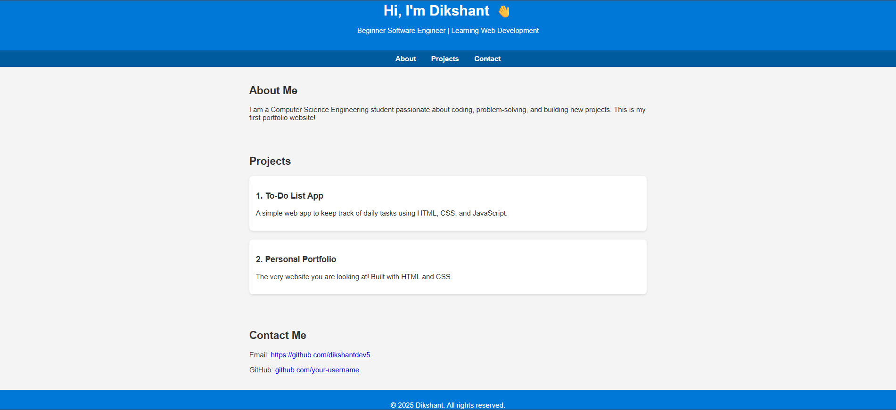

# Beginner HTML Project

This is a simple admission form webpage created using only HTML and CSS.  
The form includes fields like first name, last name, email, mobile number, gender, date of birth, address, city, state, country, caste, hobbies, qualifications, and options to upload marksheets and images.  

## Features

- Clean and user-friendly admission form layout  
- Uses basic HTML form elements and CSS styling  
- Includes a thank you page to display submitted details  

## How to Use

Open the `index.html` file in any web browser to view and interact with the form.

## Technologies Used

- HTML  
- CSS  

## Screenshot

## Contact

Created by Dikshant Gaikwad.  
GitHub: [https://github.com/dikshantdev5](https://github.com/dikshantdev5)  
LinkedIn: [https://www.linkedin.com/in/dikshant-gaikwad-1375a130a/](https://www.linkedin.com/in/dikshant-gaikwad-1375a130a/)
